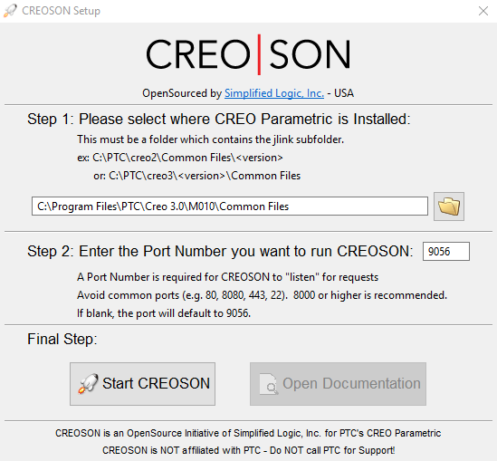

=====
Usage
=====

Launch CREOSON:

* Download last release_ of Creoson Server for your system.

* Run CreosonSetup and configure it with your Creo's version.

.. _release: https://github.com/SimplifiedLogic/creoson/releases

If you want to launch Creo with Creoson, please create a `nitro_proe_remote.bat` file.

You can copy `C:\Program Files\PTC\Creo x.x\Mxxx\Parametric\bin\parametric.bat` and rename it `nitro_proe_remote.bat` anywhere you want.

To use Creopyson in a project::

    import creopyson

Create a Client object and create a connection with Creoson::

    c = creopyson.Client()
    c.connect()

Verify is Creo is running::

    c.is_creo_running() # Return a boolean.

Launch Creo::

    c.start_creo("path to nitro_proe_remote.bat")

Basic usage::

    current_directory = c.creo_pwd()  # return current working directory.
    listfiles = c.creo_list_files() # return a list in the working directory.
    listdirs = c.creo_list_dirs() # return a list of folders in the working directory.
    c.creo_cd("new_folder")  # change working directory.
    c.file_exists("my_file.prt")  # verify if `my_file.prt` exists.
    c.file_open("my_file.prt", display=True)  # Open `my_file.prt` in Creo.
    c.dimension_set("my_file.prt", "diamm", 180)  # Modify `diamm` dimension.
    c.file_regenerate("my_file.prt")  # Regenerate file, raise `Warning` if regeneration fails.
